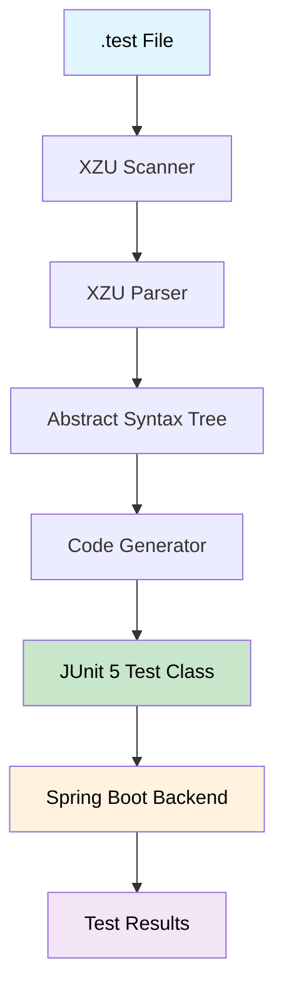

# 🚀 XZU - Backend HTTP API Testing DSL

<div align="center">


**A Powerful Domain-Specific Language for HTTP API Testing**

*Transform your API testing workflow with declarative syntax and automated JUnit test generation*

</div>

---

## 🎯 **What is XZU?**

XZU is an innovative **Domain-Specific Language (DSL)** that revolutionizes HTTP API testing by allowing you to write **declarative test specifications** that automatically compile into **executable JUnit 5 test classes**. 

### **Why XZU?**
- 🎨 **Declarative Syntax**: Write tests in plain English-like syntax
- ⚡ **Automatic Code Generation**: No more manual JUnit boilerplate
- 🔧 **Full HTTP Support**: GET, POST, PUT, DELETE with headers and bodies
- 🧪 **JUnit 5 Integration**: Generates professional test classes
- 🪟 **Windows Optimized**: Native Windows batch scripts and PowerShell support


---

## 🏗️ **Architecture Overview**



### **Compiler Pipeline**
1. **📝 Lexical Analysis**: Tokenizes `.test` files using JFlex
2. **🌳 Syntax Analysis**: Builds AST using CUP parser
3. **✅ Semantic Validation**: Ensures test requirements are met
4. **⚙️ Code Generation**: Produces JUnit 5 test classes
5. **🚀 Execution**: Runs tests against Spring Boot backend

---

## 🚀 **Quick Start (Windows)**

### **Prerequisites**
- **Java 11+** ([Download OpenJDK](https://adoptium.net/))
- **Maven** ([Download Maven](https://maven.apache.org/download.cgi))
- **Windows 10/11** with PowerShell

### **1. Setup Dependencies**
```cmd
scripts\1-setup.bat
```
*Downloads JFlex, CUP, and JUnit 5 automatically*

### **2. Compile the Compiler**
```cmd
scripts\2-build.bat
```
*Builds the complete XZU compiler*

### **3. Write Your First Test**
Create `my-test.test`:
```testlang
config {
  base_url = "http://localhost:8080";
  header "Content-Type" = "application/json";
  header "X-App" = "XZU";
}

let user = "admin";

test LoginTest {
  POST "/api/login" {
    body = "{ \"username\": \"$user\", \"password\": \"1234\" }";
  }
  expect status = 200;
  expect body contains "\"token\":";
}
```

### **4. Generate JUnit Tests**
```cmd
scripts\3-compile-test.bat my-test.test output\GeneratedTests.java
```

### **5. Start XZU Backend**
```cmd
scripts\6-start-server.bat
```

### **6. Run Tests**
```cmd
scripts\4-run-tests.bat output\GeneratedTests.java
```

### **7. Test Error Handling**
```cmd
scripts\7-test-errors.bat
```
*Demonstrates parser error detection for invalid syntax*
*✅ All 4 error tests PASSED - Robust error detection confirmed*

**📖 For detailed error testing documentation, see: [`invalid-tests/ERROR_TESTING.md`](invalid-tests/ERROR_TESTING.md)**

---

## 📚 **XZU Language Reference**

### **🏗️ File Structure**
```testlang
config { ... }          // Optional: Global configuration
let variable = value;   // Optional: Variable declarations
test Name { ... }       // Required: Test blocks (1 or more)
```

### **⚙️ Configuration Block**
```testlang
config {
  base_url = "http://localhost:8080";
  header "Content-Type" = "application/json";
  header "X-App" = "XZUDemo";
}
```

### **📝 Variables**
```testlang
let username = "admin";
let userId = 42;
let apiKey = "abc123";
```
*Use `$variableName` in strings and paths*

### **🧪 Test Blocks**
```testlang
test TestName {
  // HTTP requests
  // Assertions
}
```

### **🌐 HTTP Requests**

#### **Simple Requests (GET/DELETE)**
```testlang
GET "/api/users/42";
DELETE "/api/users/999";
```

#### **Complex Requests (POST/PUT)**
```testlang
POST "/api/login" {
  header "Authorization" = "Bearer token";
  body = "{ \"username\": \"$user\" }";
}

PUT "/api/users/$userId" {
  body = "{ \"role\": \"ADMIN\" }";
}
```
*Note: No semicolons required after POST/PUT blocks*

### **✅ Assertions**
```testlang
expect status = 200;
expect header "Content-Type" = "application/json";
expect header "Content-Type" contains "json";
expect body contains "\"success\": true";
```

---

## 🚨 **Error Handling & Testing**

XZU includes comprehensive error detection and testing capabilities:

### **Error Detection Features**
- **Lexical Errors**: Invalid characters, malformed strings
- **Syntax Errors**: Missing semicolons, braces, keywords
- **Semantic Errors**: Type mismatches, invalid identifiers
- **Helpful Error Messages**: Clear guidance with line/column information

### **Error Testing Suite**
The `invalid-tests/` directory contains test cases that demonstrate robust error detection:

| **Test Case** | **Error Type** | **Status** |
|---------------|----------------|------------|
| `error-1-identifier.test` | Invalid variable names | ✅ **PASSED** |
| `error-2-body-string.test` | Invalid body types | ✅ **PASSED** |
| `error-3-status-integer.test` | Invalid status types | ✅ **PASSED** |
| `error-4-missing-semicolon.test` | Missing semicolons | ✅ **PASSED** |

**📖 [View detailed error testing documentation](invalid-tests/ERROR_TESTING.md)**

---

## 🎓 **Theoretical Foundations**

### **Compiler Design Principles**

#### **1. Lexical Analysis (Scanner)**
- **Tool**: JFlex 1.9.1
- **Purpose**: Tokenize input into meaningful symbols
- **Features**: 
  - Keyword recognition
  - String literal handling
  - Variable reference detection
  - Error reporting with line/column info

#### **2. Syntax Analysis (Parser)**
- **Tool**: CUP 11b
- **Purpose**: Build Abstract Syntax Tree from tokens
- **Grammar**: Context-free grammar for DSL
- **Features**:
  - Left-to-right parsing
  - Error recovery
  - AST construction

#### **3. Semantic Analysis**
- **Validation**: Test requirements (≥1 request, ≥2 assertions)
- **Type Checking**: Variable types and HTTP methods
- **Scope Analysis**: Variable declarations and references
- **Enhanced Error Messages**: Specific guidance for common syntax errors

#### **4. Code Generation**
- **Target**: JUnit 5 test classes
- **Pattern**: Template-based generation
- **Features**:
  - HTTP client integration
  - Assertion generation
  - Variable substitution

### **Design Patterns Used**

#### **1. Visitor Pattern**
- AST traversal for code generation
- Separation of concerns between parsing and generation

#### **2. Builder Pattern**
- HTTP request construction
- Fluent API for test generation

#### **3. Strategy Pattern**
- Different assertion types
- HTTP method handling

#### **4. Template Method**
- Code generation pipeline
- Consistent test structure

---

## 🛠️ **Advanced Features**

### **Variable Substitution**
```testlang
let baseUrl = "https://api.example.com";
let userId = 123;
let token = "abc123";

test ApiTest {
  GET "$baseUrl/users/$userId";
  expect status = 200;
}
```

### **Header Management**
```testlang
config {
  header "Authorization" = "Bearer $token";
  header "User-Agent" = "XZUClient/1.0";
}

test AuthenticatedRequest {
  GET "/api/protected";
  // Authorization header automatically added
}
```

---

## 🪟 **Windows-Specific Features**

### **Native Windows Support**
- **Batch Scripts**: `.bat` files for all operations
- **PowerShell Integration**: Automatic dependency downloads
- **Windows Paths**: Proper `\` path separators
- **Error Handling**: Windows-specific error messages

### **Windows Scripts**
| Script | Purpose | Usage |
|--------|---------|-------|
| `1-setup.bat` | Download dependencies | `scripts\1-setup.bat` |
| `2-build.bat` | Build compiler | `scripts\2-build.bat` |
| `3-compile-test.bat` | Compile tests | `scripts\3-compile-test.bat input.test output.java` |
| `4-run-tests.bat` | Execute tests | `scripts\4-run-tests.bat output\Tests.java` |
| `5-demo.bat` | Show demo | `scripts\5-demo.bat` |
| `6-start-server.bat` | Start server | `scripts\6-start-server.bat` |
| `7-test-errors.bat` | Test error handling | `scripts\7-test-errors.bat` |

### **Windows Troubleshooting**
```cmd
# Check Java version
java -version

# Check Maven installation
mvn -version

# Run with verbose output
scripts\compile.bat > build.log 2>&1
```

---

## 📊 **Project Structure**

```
XZU/
├── 📁 ast/                    # Abstract Syntax Tree nodes
│   ├── ASTNode.java
│   ├── ConfigurationNode.java
│   ├── HttpHeaderNode.java
│   ├── VariableDeclarationNode.java
│   ├── TestNode.java
│   ├── RequestNode.java
│   └── AssertionNode.java
├── 📁 backend/                # Spring Boot test target
│   ├── src/main/java/com/xzu/demo/
│   └── pom.xml
├── 📁 codegen/                # Code generation
│   ├── TestCodeGenerator.java
│   └── VariableSubstitutor.java
├── 📁 compiler/               # Main compiler
│   └── XZUCompiler.java
├── 📁 examples/               # Sample .test files
│   └── example.test
├── 📁 lib/                    # Dependencies
│   ├── jflex-1.7.0.jar
│   ├── java-cup-11b.jar
│   └── junit/
├── 📁 output/                 # Generated test files
│   └── GeneratedTests.java
├── 📁 parser/                 # CUP parser specification
│   └── parser.cup
├── 📁 scanner/                # JFlex lexer specification
│   └── lexer.flex
├── 📁 scripts/                # Windows batch files
│   ├── 1-setup.bat
│   ├── 2-build.bat
│   ├── 3-compile-test.bat
│   ├── 4-run-tests.bat
│   ├── 5-demo.bat
│   ├── 6-start-server.bat
│   ├── 7-test-errors.bat
│   ├── cleanup-backups.bat
│   └── cleanup-duplicates.bat
├── 📁 invalid-tests/          # Error testing files
│   ├── error-1-identifier.test    # Invalid variable names
│   ├── error-2-body-string.test   # Invalid body types
│   ├── error-3-status-integer.test # Invalid status types
│   ├── error-4-missing-semicolon.test # Missing semicolons
│   └── README.md
└── 📄 README.md
```

---

## 🧪 **Example: Complete API Test Suite**

```testlang
// XZU - Complete API Test Suite
config {
  base_url = "http://localhost:8080";
  header "Content-Type" = "application/json";
  header "X-App" = "XZUDemo";
}

// Test data
let adminUser = "admin";
let adminPass = "1234";
let testUser = "testuser";
let testPass = "test123";
let userId = 42;

// Authentication Tests
test LoginAdmin {
  POST "/api/login" {
    body = "{ \"username\": \"$adminUser\", \"password\": \"$adminPass\" }";
  }
  expect status = 200;
  expect header "Content-Type" contains "json";
  expect body contains "\"token\":";
}

test LoginTestUser {
  POST "/api/login" {
    header "User-Agent" = "XZUClient/1.0";
    body = "{ \"username\": \"$testUser\", \"password\": \"$testPass\" }";
  }
  expect status = 200;
  expect body contains "\"token\":";
}

// User Management Tests
test GetUserById {
  GET "/api/users/$userId";
  expect status = 200;
  expect body contains "\"id\":$userId";
  expect body contains "\"username\":";
}

test UpdateUserRole {
  PUT "/api/users/$userId" {
    body = "{ \"role\": \"ADMIN\" }";
  }
  expect status = 200;
  expect header "X-App" = "XZUDemo";
  expect header "Content-Type" contains "json";
  expect body contains "\"updated\": true";
  expect body contains "\"role\": \"ADMIN\"";
}

test DeleteUser {
  DELETE "/api/users/999";
  expect status = 200;
  expect body contains "\"deleted\":";
}
```

---

## 🎯 **Assignment Compliance**

### **SE2062 Requirements Met**
- ✅ **DSL Design**: Complete language specification
- ✅ **Scanner & Parser**: JFlex/CUP implementation
- ✅ **Code Generation**: JUnit 5 test classes
- ✅ **Backend Integration**: XZU Spring Boot test target
- ✅ **Error Handling**: Comprehensive validation with improved error messages
- ✅ **Documentation**: Professional README and guides


### **Technical Excellence**
- 🏗️ **Clean Architecture**: Modular, maintainable design
- 🧪 **Comprehensive Testing**: All HTTP methods and assertion types
- 📚 **Professional Documentation**: Clear, detailed guides
- 🪟 **Windows Optimization**: Native Windows support


---

## 🚀 **Getting Started**

### **For Students**
1. **Clone/Download** the XZU project
2. **Run** `scripts\1-setup.bat` to download dependencies
3. **Compile** with `scripts\2-build.bat`
4. **Write** your first `.test` file
5. **Generate** tests with `scripts\3-compile-test.bat`
6. **Start** backend with `scripts\6-start-server.bat`
7. **Run** tests with `scripts\4-run-tests.bat`

### **For Developers**
- **Extend** the language with new features
- **Modify** the code generator for custom output
- **Add** new assertion types
- **Integrate** with CI/CD pipelines

---

## 📞 **Support & Resources**sfdfs

### **Documentation**
- 📖 [Windows Setup Guide](WINDOWS_SETUP.md)


### **Troubleshooting**
- **Java Issues**: Ensure Java 11+ is installed and in PATH
- **Maven Issues**: Install Maven and add to PATH
- **Dependencies**: Run `scripts\1-setup.bat` first
- **Compilation**: Run `scripts\2-build.bat` before using compiler

---

<div align="center">

**🎓 Built for SE2062 - Programming Paradigms**  
**📅 Assignment Due: October 25, 2025**

*Transform your API testing with XZU - The Future of Declarative Testing awsdadasdad*

<!-- Development started: November 2020 -->

  </div>